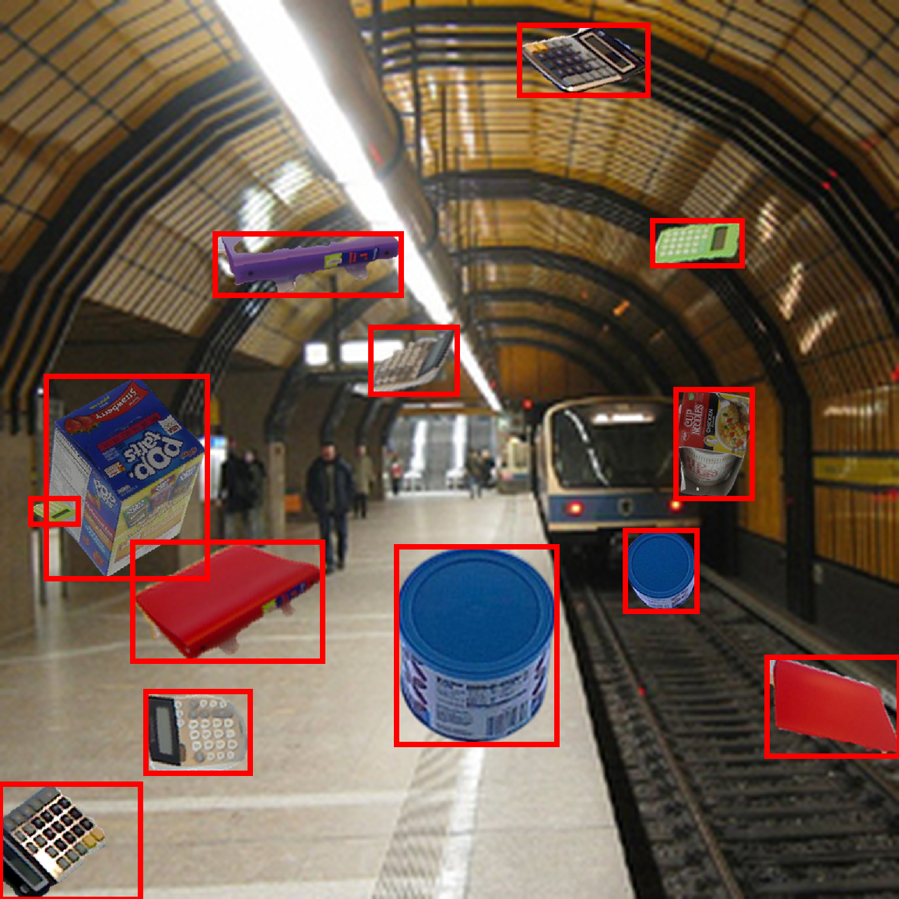

[](https://github.com/debidatta/syndata-generation)
[](https://github.com/a-nau/synthetic-dataset-generation/actions)
[](https://arxiv.org/abs/2210.09814)


# Synthetic Dataset Generation

Create copy/paste synthetic images for object detection and instance segmentation.

> This repository is a modified (and extended) version
> of [debidatta/syndata-generation](https://github.com/debidatta/syndata-generation) and [a-nau/synthetic-dataset-generation](https://github.com/a-nau/synthetic-dataset-generation/actions)
> The augmentation code is not changed. The code was made more modular All credits to the original authors (also see [Citation](#citation)).
>


<!-- ADD IMAGES -->


## Set-up
Clone the repository

```shell
git clone https://github.com/JureHudoklin/CopyPaste_DatasetGenerator.git
```

Create a virtual environment (optional) and activate it

```shell
virtualenv -p python3.8 copy_paste_env
source copy_paste_env/bin/activate
```

Install python dependencies

```shell
pip install -r requirements.txt
```

## Configuration

### Image Annotation Files
To generate a dataset two json annotation files are required.
1. A json file containing the annotations of the objects
2. A json file containing the annotations of the background images

- Objects json files should have the following information:
  List of objects:
  ```json
  [
    {
      "name": "example_cat", # name-of-the-category
      "supercategory": "example_super_cat", #name-of-the-super-category
      "file_name": "my_img_0.jpg", #name-of-the-image-file
      "img_path": "home/my_home/images/my_img_0.jpg", #absolute-path-to-the-image-file
    },
    ...
  ]
  ```

- Background json files should have the following information:
  List of background images:
  ```json
  [
    {
      "file_name": "my_img_0.jpg", #name-of-the-image-file
      "img_path": "home/my_home/images/my_img_0.jpg", #absolute-path-to-the-image-file
    },
    ...
  ]
  ```


### Configuration File
You can configure the dataset generation by editing the config.py file inside the configs folder.
All options are explained in the config.py file.
**MAKE SURE TO SET PATHS TO ANNOTATION FILES AND OUTPUT FOLDER INSIDE THE CONFIG FILE.**

If you provide a load_path when creating a new dataset, the config file will be loaded from the provided path.
```python
from configs.config import Config

cfg = Config(load_path = "path/to/config/file/filename.json"")
```

You can also save a config by running the following command:
```python
from configs.config import Config

cfg = Config()
config.save(path)
```

## Run
To generate a dataset you can run generate_dataset.py:
```shell
python3 generate_dataset.py
```

## Citation

If you use this code for scientific research, please consider citing the following two works on which this repository is based on.

### Cut, Paste and Learn: Surprisingly Easy Synthesis for Instance Detection

The original work, including the [code](https://github.com/debidatta/syndata-generation) on which this repository is
built. Thanks a lot to the authors for providing their code!

```latex
@InProceedings{Dwibedi_2017_ICCV,
author = {Dwibedi, Debidatta and Misra, Ishan and Hebert, Martial},
title = {Cut, Paste and Learn: Surprisingly Easy Synthesis for Instance Detection},
booktitle = {The IEEE International Conference on Computer Vision (ICCV)},
month = {Oct},
year = {2017}
}
```

- Paper: [arxiv](https://arxiv.org/abs/1708.01642)
  and [ICCV 2017](https://openaccess.thecvf.com/content_ICCV_2017/papers/Dwibedi_Cut_Paste_and_ICCV_2017_paper.pdf)

### Scrape, Cut, Paste and Learn: Automated Dataset Generation Applied to Parcel Logistics

Our work for which this repository was developed.

```latex
@inproceedings{naumannScrapeCutPasteLearn2022,
  title = {Scrape, Cut, Paste and Learn: Automated Dataset Generation Applied to Parcel Logistics},
  booktitle = {{{IEEE Conference}} on {{Machine Learning}} and Applications} ({{ICMLA}})},
  author = {Naumann, Alexander and Hertlein, Felix and Zhou, Benchun and Dörr, Laura and Furmans, Kai},
  date = {2022},
}
```
